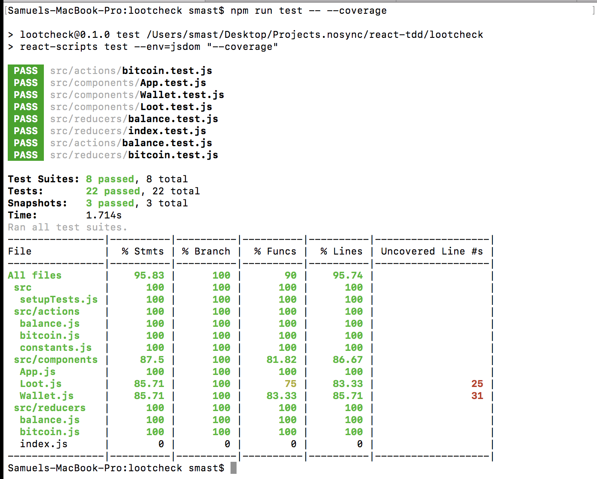

# Purpose 

* I created this app to learn/practice TDD w/ Redux (Test Driven Development)

- Tests written with Jest

- Created with Create React App

- Uses Redux to manage state

## App Functionality:

- App to track wallet amount (Check your Loot). Can 'withdraw' and 'deposit' funds into account.

### Testing:

-Running testing with Jest

